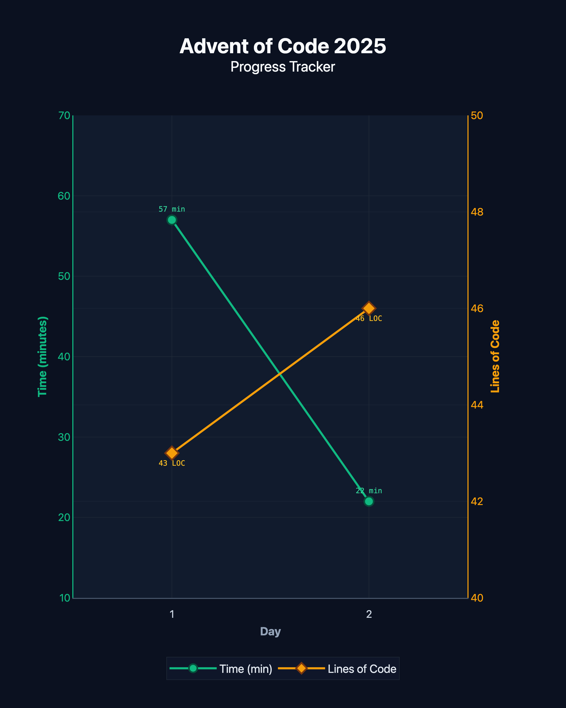

# Advent of Code 2025



My solutions for [Advent of Code 2025](https://adventofcode.com/2025), written in Python.

## Usage

```bash
# Run a specific day's solution
python day1/safe_cracker.py

# Initialize/update REMARKS.md with metrics for a day (runs cloc + gtime)
python init_remarks.py <day>

# Generate the progress chart
python generate_graph.py
```
